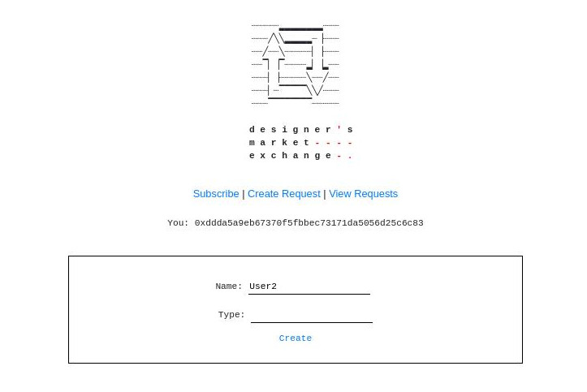
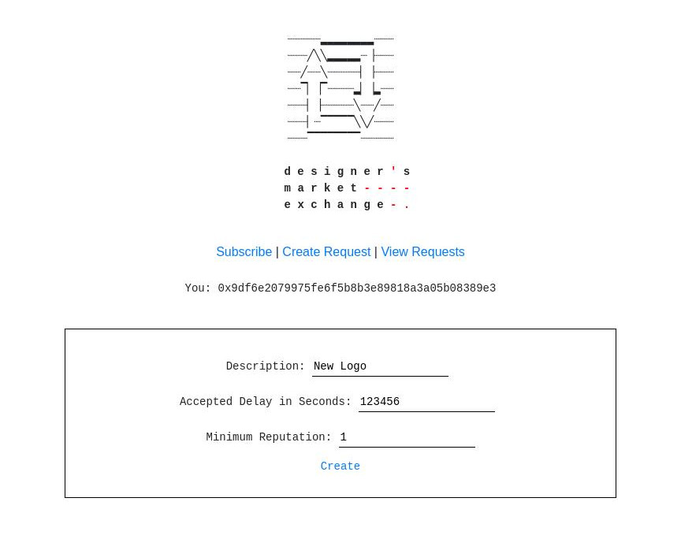

// wip

# Designer's Market Exchange
Just a small contract that implements an exchange for independent designers.

dApp currently deployed on Ropsten : 0x48edd3f63E6b3B23eF03E0898df6687bEC21aCA0

You will need metamask to interact with it.

# Some Screen Captures

### Subscription Screen

### Subscription Screen

### View Requests Screen

---- 

### TODO:
- make ui
- add events
- testnet