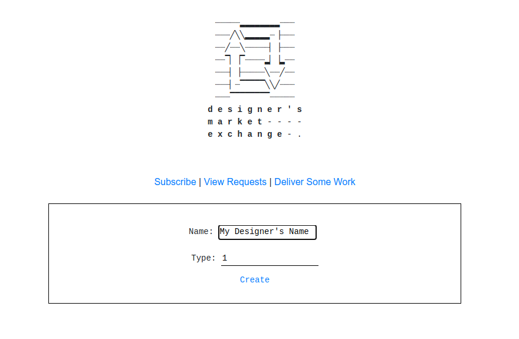
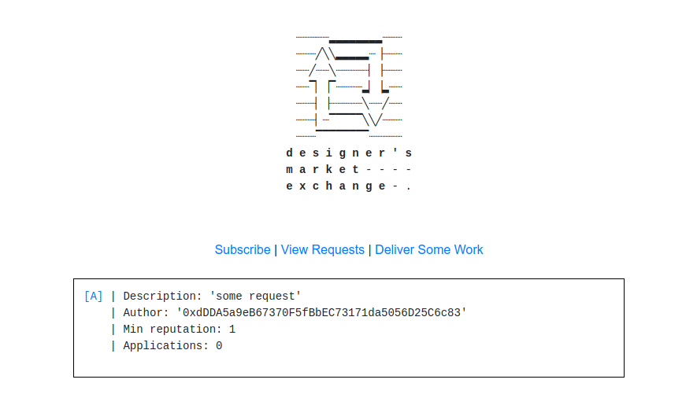

// wip

# Designer's Market Exchange
Just a small contract that implements an exchange for independent designers.
dApp currently deployed on Ropsten : 0xec5ceb302bf9d2137f553ab1ffb5af39a775ca26
You will need metamask to interact with it.

# Some Screen Captures
### Subscription Screen

### View Requests Screen

---- 

### TODO:
- make ui
- add events
- testnet